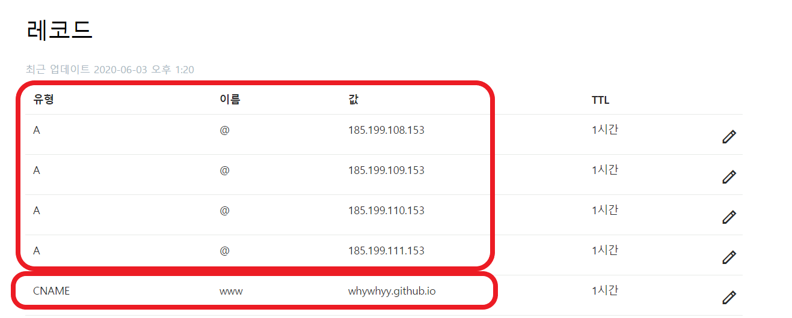
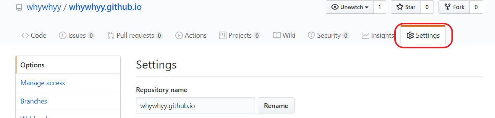
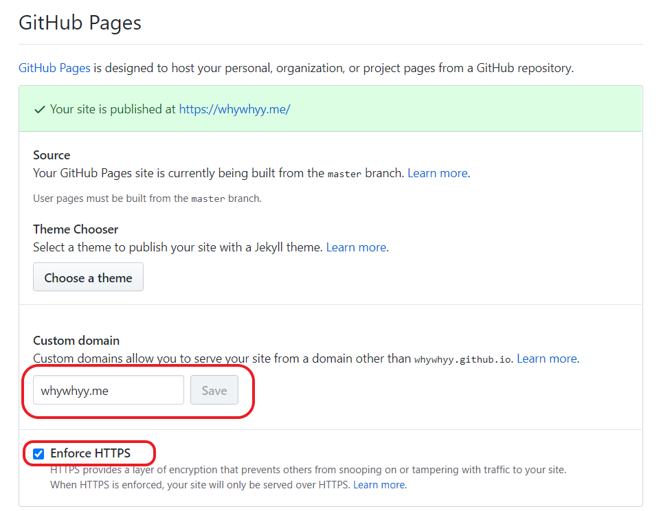

## GitHub Pages(github.io)
깃헙에서 웹 호스팅을 해준다! [(생활코딩 링크)](https://opentutorials.org/course/3084/18891)

username.github.io 로 repo를 만들어서 Gatsby,Jekyll,Hugo 같은 프레임워크로 작성하여 push 된다.~~말은쉽다..~~

~~[다른건 써보지 않았지만 게츠비가 게츠비가 짱이라고한다.](https://www.gatsbyjs.org/features/)~~

## 내 도메인과 github.io 를 연결하자

### 도메인 구매
일단은 도메인을 구매해야한다. 적절하게 .dev .info .me .org 등 에서 원하는 도메인을 구입하자. 유명해보이고(?) 제일 싼곳이 좋다!
지금 사용중인 whywhyy.me 는godaddy 에서 구매하였다. 

### 도메인 DNS 세팅 (CNAME 추가, A 레코드 추가)
Github Help - GITHUB PAGES 의 [(링크)](https://help.github.com/en/github/working-with-github-pages/managing-a-custom-domain-for-your-github-pages-site#about-custom-domain-configuration) 
에 적혀있는대로(?) 하면된다.

### github repo Setting
github repo를 세팅하자 !

Repo - Settings - Github Pages  에서 custom domin 에 구매한 도메인을 넣어 Save 하자. 

(아래 사진과 같이 설정하면 된다.)

DNS 전파시간이 걸리기도 하고, HTTPS 체크박스도 github에서 증명서가 활성화 되면 체크가 가능하다. 기다리는 과정이 인내심을 요한다. 😀

~~왜 안되지.. 절망하고 있다가 시간이 지나니(?!) 설정이 완료되었다.~~

--- 
## 참고

- [생활코딩 : 깃헙 웹 호스팅 설명](https://opentutorials.org/course/3084/18891)

- [생활코딩 : A 레코드, CNAME 관련](https://opentutorials.org/course/3276/20313)

- [Github Page 레퍼런스](https://help.github.com/en/github/working-with-github-pages/managing-a-custom-domain-for-your-github-pages-site#about-custom-domain-configuration) 

- ~~[게츠비 짱짱](https://www.gatsbyjs.org/features/)~~