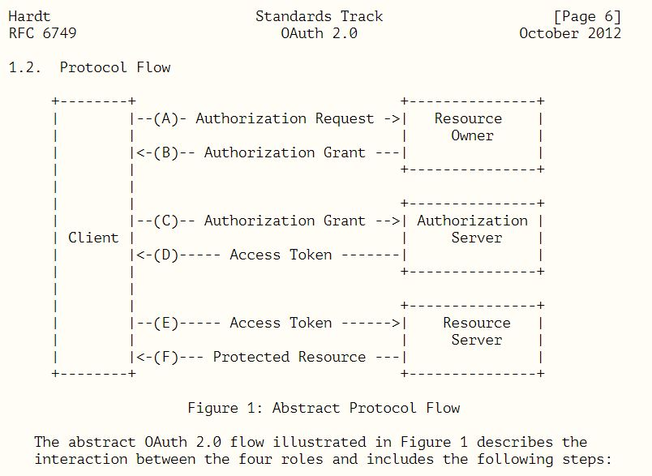
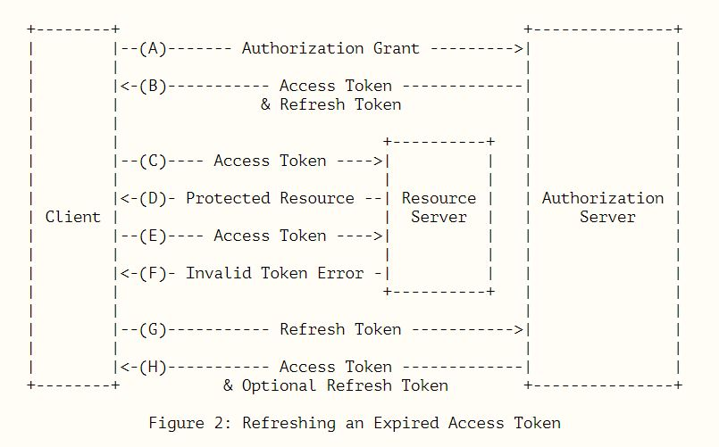

## 왜 만들었지?

   > Abstract
   > 
   > The OAuth 2.0 authorization framework enables a third-party
   > application to obtain limited access to an HTTP service, either on
   > behalf of a resource owner by orchestrating an approval interaction
   > between the resource owner and the HTTP service, or by allowing the
   > third-party application to obtain access on its own behalf.  This
   > specification replaces and obsoletes the OAuth 1.0 protocol described
   > in RFC 5849.

   제 3자의 서비스가 다른 서비스의 사용자의 정보를 얻어오기 위함이다.

## 프로토콜에 참여하는 주체

 oauth2 의 resource owner, resource server, client, authorization server 의 개념을 알아두자

---

   > resource owner
   > 
   > An entity capable of granting access to a protected resource.
   > When the resource owner is a person, it is referred to as an
   > end-user.

resource owner - 실제 유저라고 생각하면된다.

---
   
   > resource server
   >
   > The server hosting the protected resources, capable of accepting
   > and responding to protected resource requests using access tokens.

resource server - 실제 유저의 정보를 가지고 있는 서버이다.

---

   > client
   >
   > An application making protected resource requests on behalf of the
   > resource owner and with its authorization.  The term "client" does
   > not imply any particular implementation characteristics (e.g.,
   > whether the application executes on a server, a desktop, or other
   > devices).

client - 유저의 정보를 알고싶은 제3의 서비스 라고 보면된다.

---

   > authorization server
   >
   > The server issuing access tokens to the client after successfully
   > authenticating the resource owner and obtaining authorization.

authorization server - resource server 서버에 대한 접근 token 을 다루는 서버이다. 
 보통 resource server 와 authorization server 가 동일한 서버인 경우가 대부분이다.

---

## 프로토콜

#### protocol flow

어떻게 동작하는지 감이 잘 안온다.

다행히 생활코딩에서 동영상으로 잘 만들어서 무료로 공개하였다.
 
 - 생활코딩 WEB2 - OAuth 2.0 (https://opentutorials.org/module/3668)

## 시나리오

#### Resource Server 에 Client 등록

Client 는 Resource Server(동시에 authorization server 기능도 가지고있다고 가정하자.) 에 APP (redirect url 등)을 등록한다.

Resource Server 는 Client 에게 Client ID 와 Client Secret 을 발급한다.

 
---

주체 : 가지고있는 정보

Resource Server : Client ID, Client Secret, Callback url, Resource(E-mail,Name 등)

Client : Client ID, Client Secret, Callback url

Resource Owner :

---

### Resource Owner 가 Resource Server 에게 허가요청

 Resource Owner 는 Resource Server 에게 Client 에게 데이터를 공유해도 된다고 허락하는 과정을 거친다.

 1. Client 는 Resource Owner 가 Resource Server 에게 request 하도록 함.
 
 예를 들어 다음과 같은 URL을 새창을 띄워 보여줌

 https://resource.server/?client_id={client_id}&scope={name,E-mail}&redirect_uri=https://client/callback

 2. Resource Owner 는 Resource Server 의 인증절차(로그인)를 거침

 3. Resource Server 는 Resource Owner 에게 Client 에게 Resource({name,E-mail})정보 제공 허용는지 확인절차를 진행

### 허가 후 Callback 및 Client 의 코드획득

 Resource Owner 의 허가를 받은 Resource Server 는 Callback url(https://client/callback?code={code}) 에 code 정보를 담아 redirect 한다.

 Callback Url 을 통해 Client 는 code 정보를 받게 된다.

 1. Resource Server 는 Client 에게 Callback url(https://client/callback?code={code}) 정보를 전달함.

 2.  Client 는 Client ID, Client Secret, Authorization code 를 조합하여 Resource Server 에게 데이터를 전송함.
     
     ex) https://resource.server/token?
     
     grant_type=authorization_code
     
     &code={code} 
     
     &redirect_uri=https://client/callback
     
     &client_id={client_id}
     
     &client_secret={client_secret}

---

주체 : 가지고있는 정보

Resource Server : Client ID, Client Secret, Callback url, Resource(E-mail,Name 등)

Client : Client ID, Client Secret, Callback url, Authorization code 

Resource Owner : Authorization code 

---

### code 로 Access token 획득

 조합한 정보(Authorization code, Client Id, Client Secret,redirect_uri) 를 보낸 Client 는 
 Resource Server 로 부터 Access token 과 Refresh Token 을 획득한다.

 Authorization code 는 재사용 되지 않으므로, Resource Server, Client 두 곳 모두에서 파기된다.

 1. Resource Server 는 Client 에게 Access token 과 Refresh Token 을 제공

 2. Authorization code 는 파기됨.

---

주체 : 가지고있는 정보

Resource Server : Client ID, Client Secret, Callback url, Resource(E-mail,Name 등), Access token, Refresh Token

Client : Client ID, Client Secret, Callback url, Access token, Refresh Token

Resource Owner : 

---

### Access token & Refresh Token

 추후 Client 는 Access token 을 이용하여 Resource Server 로 부터 Resource Owner 의 정보를 가져온다.

 Access token 이 파기되거나 문제가 생겨 사용 할 수 없는경우 Refresh token 을 이용하여, 새 Access token 을 획득한다. 

 (optional) Refresh token 을 이용하여 새 token을 획득하는 경우, Refresh token 이 재사용 되기도 하고, 새 Refresh token 으로 변경되기도 한다.

---

## 참고

 - https://tools.ietf.org/html/rfc6749
 - https://opentutorials.org/module/3668