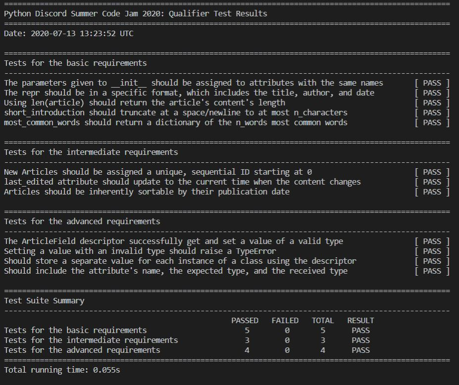

 우연히 파이썬관련 커뮤니티를 찾다가 python discrod 라는 커뮤니티를 찾게되었고,
 자체적으로 스폰서도 받아 잘 code jam을 잘 운영하고 있어 대회에 참가하게되었다.
 
## Code Jam

 - https://pythondiscord.com/pages/code-jams/code-jam-7/

  (문제에 대한 자세한 설명은 위의 링크를 참고하자.)

참가를 위해서는 qualifier 문제를 풀어야한다. 즉, 테스트 코드를 PASS 하는 qualifier.py 코드를 작성하면 된다. 
 

### 테스트 코드는 PASS

 qualifier.py의 테스트 코드는 합격했다.
  
 이제 본선(?)으로 가는 티켓의 결과를 기다리고 있다.

제출은 google form에 작성해서 제출한다. 혹시나해서 짧은 영어로 한번더 물어보니 맞다고한다.

> whywhyy : Should I copy and submit the qualifier.py code?
> or github url ?
>
> kosayoda : just paste the contents of qualifier.py straight into the text field
>
> whywhyy : Yeah. Thank you.

 복붙해서 잘 제출했다.

### 테스팅코드를 통해 배우다.

 TDD 기반으로 된 문제를 푸는 정말 좋은 기회였다.

 문제를 풀기위해 테스트 코드를 읽어야 하는데, 이 테스팅 코드가 작성되어 동작하는것을 보는것 자체가 일단은 배울점이다.

 클래스를 커스터마이징 하기위해 repr, len, lt 를 다루는 점도 좋았다.

 클래스 객체를 다루는 set, get 도 다뤄보는 좋은 기회였다.

 문제중 class 의 내부 id 를 핸들링하는것도 좋았다. 

---

> 코드는 당연히 qualifier 기간이 끝나면 올리도록 하겠습니다.