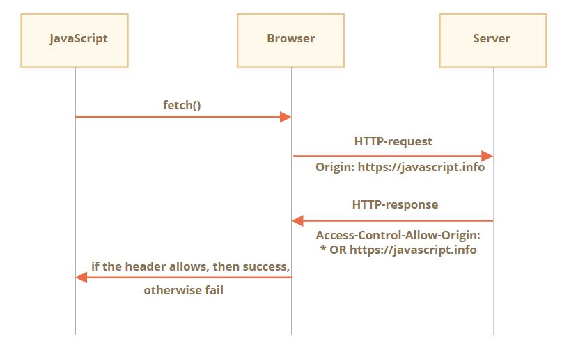
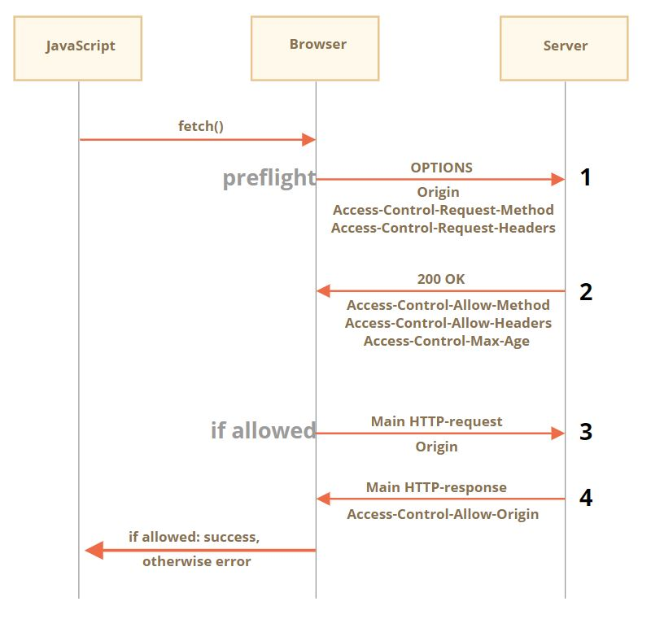

## CORS ?? 
 
 교차 출처 리소스 공유(Cross-Origin Resource Sharing, CORS) 란?

  **추가 HTTP 헤더를 사용하여, 한 출처(도메인)에서 실행 중인 웹 애플리케이션이 다른 출처(도메인)의 선택한 자원에 
 접근할 수 있는 권한을 부여하도록 브라우저에 알려주는 체제**

예를 들어 https://domain-a.com 에서 Fetch API or Ajax 를 이용하여 https://domain-b.com/data.json 에 
 데이터를 요청하는 상황을 위한 정책이라고 생각하면된다.

 근대 왜 만들었을까?? SOP 에 대해 알아보자. 

## SOP ??

  동일 출처 정책(same-origin policy)

  ** 동일출처 : 두 URL의 프로토콜, 포트(명시한 경우), 호스트가 모두 같아야 동일한 출처라고 말합니다. **

  http://store.company.com/dir/page.html 의 출처 라고할때, 동일 출처는 다음과 같다.


  | URL | 결과 | 이유 | 
  | --- |  --- |   ---- | 
  | http://store.company.com/dir2/other.html	| 성공	| 경로만 다름
  | http://store.company.com/dir/inner/another.html	| 성공	| 경로만 다름
  | https://store.company.com/secure.html	| 실패	| 프로토콜 다름
  | http://store.company.com:81/dir/etc.html	| 실패	| 포트 다름 (http://는 80이 기본값)
  | http://news.company.com/dir/other.html	| 실패	| 호스트 다름

## 교차출처 와 브라우저

교차 출처에 따른 브라우저의 통제방법을 알아보자.

  교차출처시 쓰기(writes), 읽기(read), 삽입(embedding) 에 대해 알아보자

  > Cross-origin writes are typically allowed. Examples are links, redirects, and form submissions. 
  > Some HTTP requests require preflight.
  >
  > Cross-origin reads are typically disallowed, but read access is often leaked by embedding.
  > For example, you can read the dimensions of an embedded image, the actions of an embedded script,
  > or the availability of an embedded resource.
  >
  > Cross-origin embedding is typically allowed. (Examples are listed below.)

- link, redirects, submissions 과 같은 write는 교차출처가 허용된다. preflight 를 사용해야 허용되는 경우가 있는데,
  이 경우는 CORS 의 Simple requests 가 아닌 경우 이다. 
- 읽기의 경우 보통 불허 된다.
- img, video, embeded 태그는 가능하다.
- script 의 경우 스크립트에 정의에 따라 다르다. css, @font-face 는 브라우저마다 다르다. 

 
### 교차출처 막기
  
  - 교차 출처 요청 위조(Cross-Site Request Forgery, CSRF) 토큰 를 활용해서 막는다 !
  - 쿠키로 저장되어 토큰이 저장되어 헤더로 전송되거나, form 필드에서 히든필드를 이용하여 전송한다.


## CORS 가 허용되는 호출
  
  그렇다면 CORS 가 허용되는 호출들을 알아보자

  - XMLHttpRequest, Fetch API 호출.
  - 웹 폰트(CSS 내 @font-face에서 교차 도메인 폰트 사용 시)
  - WebGL 텍스쳐
  - drawImage()를 사용해 캔버스에 그린 이미지/비디오 프레임.
  - 이미지로부터 추출하는 CSS Shapes.


## CORS 적용

  ** 교차출처를 허용하기 위해서는 CORS 를 적용하자!**
  
 Simple request 와 preflighted request 가 존재한다. 각각에 대해 알아보자.

### Simple request

 simple request 를 사용해야하는 경우는 아래의 두 조건을 모두 충족해야한다.

 - Method : GET, HEAD, POST 인 경우
 - Header : Accept, Accept-Language, Content-Language, DPR, Downlink, Save-Data, Viewport-Width, Width
   Content-Type 는 application/x-www-form-urlencoded, multipart/form-data, text/plain


 

1. 크로스 오리진 요청을 보낼 경우 브라우저는 항상 Origin이라는 헤더를 요청에 추가합니다.(위의 경우 https://javascript.info 에서 다른 도메인으로 요청을 보내는 경우)

2. 브라우저는 서버로부터 받은 응답에 Access-Control-Allow-Origin이 있는지를 확인해 서버가 해당 요청을 허용했는지 아닌지를 확인합니다. 
 
3. 헤더에 Access-Control-Allow-Origin이 있다면 자바스크립트를 사용해 응답에 접근할 수 있고 아닌 경우엔 에러가 발생합니다.
 
즉, 서버측에서 Access-Control-Allow-Origin: https://javascript.info 혹은 Access-Control-Allow-Origin: * 헤더가 있어야 브라우저가 해당 데이터에 접근하게 된다.


 client : simple 요청의 경우 Origin이라는 헤더를 요청에 추가됨

 서버개발자의 경우 simple 요청의 경우를 고려하여, 응답헤더에 Access-Control-Allow-Origin 를 추가해야한다.


#### 응답헤더

 크로스 오리진 요청이 이뤄진 경우, 자바스크립트는 기본적으로 ‘simple’ 응답 헤더라 불리는 헤더에만 접근 할 수 있다.

 - Header : Cache-Control, Content-Language, Content-Type, Expires, Last-Modified, Pragma

자바스크립트를 사용해 ‘simple’ 응답 헤더 이외의 응답 헤더에 접근하려면 서버에서 Access-Control-Expose-Headers라는 헤더를 보내줘야만 합니다.
 Access-Control-Expose-Headers엔 자바스크립트 접근을 허용하는 non-simple 헤더 목록이 담겨있습니다. 각 항목은 콤마로 구분된다.

```yml
200 OK
Content-Type:text/html; charset=UTF-8
Content-Length: 12345
API-Key: 2c9de507f2c54aa1
Access-Control-Allow-Origin: https://javascript.info
Access-Control-Expose-Headers: Content-Length,API-Key
```


---

### Preflighted request

 'non simple' 요청의 경우 브라우저는 서버에 바로 요청을 보내지 않고, 
 ‘preflight’ 요청이라 불리는 사전 요청을 서버에 먼저 보내 권한이 있는지를 확인합니다.
 

** 1. preflight 요청**

preflight 요청은 OPTIONS 메서드를 사용한다. 헤더엔 아래 두 항목이 들어가고, 본문은 비어있다.

- Access-Control-Request-Method 헤더 – non-simple 요청에서 사용하는 메서드 정보가 담겨있습니다.
- Access-Control-Request-Headers 헤더 – non-simple 요청에서 사용하는 헤더 정보가 담겨있습니다. 
각 항목은 쉼표로 구분된다.


```javascript
let response = await fetch('https://site.com/service.json', {
  method: 'PATCH',
  headers: {
    'Content-Type': 'application/json',
    'API-Key': 'secret'
  }
});
```

```yml
OPTIONS /service.json
Host: site.com
Origin: https://javascript.info
Access-Control-Request-Method: PATCH
Access-Control-Request-Headers: Content-Type,API-Key
```


**2. preflight 응답**

서버는 상태 코드 200과 함께 다음과 같은 헤더를 담은 응답을 보낸다.

- 다양한 메소드를 사용하기위해서는 Access-Control-Allow-Methods 헤더에 사용하고자하는 메소드를 추가한다.

- 다양한 헤더를 사용하기 위헤서는  Access-Control-Allow-Headers 헤더에 사용하고자하는 메소드를 추가한다.

- Access-Control-Max-Age는 다른 preflight request를 보내지 않고, preflight request에 대한 응답을 캐시할 수 있는 시간(초)을 제공한다.

```yml
200 OK
Access-Control-Allow-Methods: PUT,PATCH,DELETE
Access-Control-Allow-Headers: API-Key,Content-Type,If-Modified-Since,Cache-Control
Access-Control-Max-Age: 86400
```


** 3. 실제 요청 **

```yml
PATCH /service.json
Host: site.com
Content-Type: application/json
API-Key: secret
Origin: https://javascript.info
```


** 4. 실제 응답 **

 Access-Control-Allow-Origin 이 항상 추가되어 응답되어야 한다.
  
```yml
Access-Control-Allow-Origin: https://javascript.info 
```



### 인증정보 포함된 CORS
  
  인증 정보가 포함된 요청(credentialed requests)은 보통 HTTP cookies 와 HTTP Authentication 정보를 전송한다. 그런데

   **브라우저에서는 XMLHttpRequest 나 Fetch 호출로 요청되는 크로스 오리진 요청은 자격(인증 정보) 증명을 보내지 않는다.**

  CORS 상황에서 인증정보를 전송하기 위해서는 XMLHttpRequest 객체나 Request 생성자가 호출될 때 특정 플래그를 설정해야 전송이 가능하다.

 ** 1. 요청 **

 - XMLHttpRequest 에서는 withCredentials 를 true 로 설정

 - fetch 에서는 credentials: "include" 를 추가

```javascript
const invocation = new XMLHttpRequest();
const url = 'http://bar.other/resources/credentialed-content/';

function callOtherDomain() {
if (invocation) {
    invocation.open('GET', url, true);
    invocation.withCredentials = true;
    invocation.onreadystatechange = handler;
    invocation.send(); 
  }
}
```

  ```javascript
  fetch('http://another.com', {
  credentials: "include"
});
  ```


**2. 응답 **
 
  응답헤더에 Access-Control-Allow-Credentials: true 헤더가 없다면 응답을 거부한다.

  따라서,

  - Access-Control-Allow-Origin 헤더와 함께 Access-Control-Allow-Credentials: true 가 존재해야한다.

  그리고

  - Access-Control-Allow-Origin에 *을 쓸 수 없다.
  Access-Control-Allow-Origin :{Origin} 가 명시적으로 작성되야 한다.

```yml
200 OK
Access-Control-Allow-Origin: https://javascript.info
Access-Control-Allow-Credentials: true
```

---

## 참고

 - https://developer.mozilla.org/ko/docs/Web/HTTP/CORS
 - https://developer.mozilla.org/ko/docs/Web/Security/Same-origin_policy
 - https://ko.javascript.info/fetch-crossorigin
 - https://developer.mozilla.org/ko/docs/Web/HTTP/Authentication
