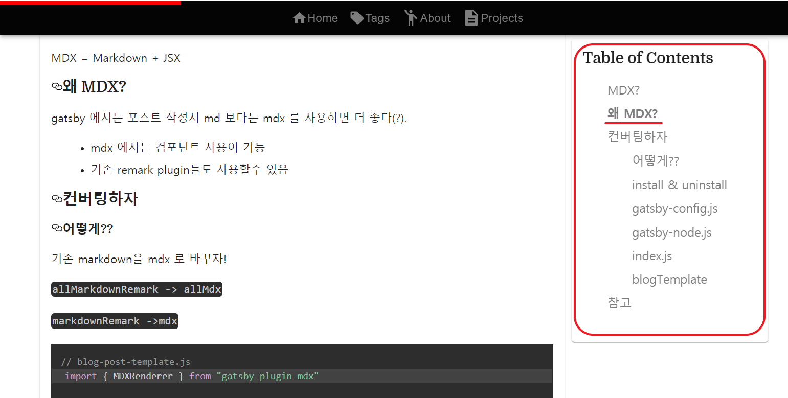

## 목표
 - Heading Tag 리스트화
 - TOC 요소 클릭시 이동
 - 읽고 있는 단락 highlight

 


## 구현하자

### autolink headers 

먼저 h2,h3.. 헤더들을 어떻게든 파싱해서 링크를 달아야 한다.

그런데, 누군가도 똑같은 고민을 하고있었는지, 이미 플로그인이 만들어져 제공되고 있었다! 심지어 다운로드 수도 상당하다. (162.9k 2020-06-11 기준) 


 - [gatsby-remark-autolink-headers](https://www.gatsbyjs.org/packages/gatsby-remark-autolink-headers/)

설치, 설정, 실행 해보자

#### install

```bash
npm install --save gatsby-remark-autolink-headers
```

#### config

```yml
#gatsby-config.js 
    ...
    {
      resolve: `gatsby-plugin-mdx`,
      options: {
        extensions: [`.mdx`, `.md`],
        gatsbyRemarkPlugins: [
          ...
          {
            resolve: `gatsby-remark-autolink-headers`,
            options: {
              offsetY: `200`,
              className: `custom-class`,
              maintainCase: false,
              removeAccents: true,
              elements: [`h2`, `h3`,`h4`,`h5`],
            },
          },
          ...
        ],
      },
    },
    ...
```


#### graphql & result

```js
// graphql
{
  mdx(frontmatter: {url_path: {eq: "/blog/2020/06/08/markdown-to-mdx"}}) {
    tableOfContents
  }
}

```

```json
// result
{
  "data": {
    "mdx": {
      "tableOfContents": {
        "items": [
          {
            "url": "#mdx",
            "title": "MDX?"
          },
          {
            "url": "#왜-mdx",
            "title": "왜 MDX?"
          },
          {
            "url": "#컨버팅하자",
            "title": "컨버팅하자",
            "items": [
              {
                "url": "#어떻게",
                "title": "어떻게??"
              },
              {
                "url": "#install--uninstall",
                "title": "install & uninstall"
              },
              {
                "url": "#gatsby-configjs",
                "title": "gatsby-config.js"
              },
              {
                "url": "#gatsby-nodejs",
                "title": "gatsby-node.js"
              },
              {
                "url": "#indexjs",
                "title": "index.js"
              },
              {
                "url": "#blogtemplate",
                "title": "blogTemplate"
              }
            ]
          },
          {
            "url": "#참고",
            "title": "참고"
          }
        ]
      }
    }
  }
}
```
## auto-highlight
그런데 어떻게 만들지. 구현되어 있고, 잘 만들어진 소스를 찾아보자

- [gatsbyjs 홈페이지의 TOC 코드를 ~~훔쳐보자~~ 참고하자. 오픈소스이니 코드가 깔끔할것같다!](https://www.gatsbyjs.org/docs/quick-start/)


### 코드를 읽어보자
코드를 탐방해보니(?)(https://github.com/gatsbyjs/gatsby)
 
 DOCS 가 작성되는 부분을 따라가 TOC 동작의 핵심적인 부분을 확인하였다.

 - [TOC 가 작성되는 코드](https://github.com/gatsbyjs/gatsby/blob/master/www/src/components/docs-table-of-contents.js)
 
 - [Highlight 관련 코드](https://github.com/gatsbyjs/gatsby/blob/master/www/src/hooks/use-active-hash.js)


```yml
 # components/table-of-contents.js
getHeadingIds : toc 객채를 받아 순서대로 input된 하나의 리스트로 만든다. 
 items(toc) 구조는  다음과 같다.
  object = url, title, object  뭔가 당연하지만 리커시브하게 생겼다(?)

  items  [objcet] 

  items[].url        must 
  items[].title      must 
  items[].[object]  optional
createItems : toc 객체와 hook/useEffect 로 값이 변경되는 isActive 을 받아 테이블을 그린다!
```

```yml
 # hook/use-active-hash.js
useActiveHash : TOC 리스트를 받아 IntersectionObserver로 isIntersecting 인지 확인하여, 해당 id 로 activeHash를 설정한다.

```

### hook & IntersectionObserver

코드를 이해하는라 공부할 수 밖에 없었다. ~~내 코드로 녹여내려면 어쩔수 없다~~

코드를 가져와 내 블로그로 녹였다!


- hook/use-active-hash.js

```js
//  hook/use-active-hash.js
import { useEffect, useState } from "react"

export const useActiveHash = (itemIds, rootMargin = undefined) => {
  const [activeHash, setActiveHash] = useState(``)  // highlight-line
  // activeHash = 변수, setActiveHash = activeHash 의 값을 set 하는 함수, useState 상태값
  useEffect(() => { // highlight-line
  // useEffect 리액트 컴포넌트가 렌더링 될 때마다 특정 작업을 수행하도록 설정 할 수 있는 Hook 입니다
  // 클래스형 컴포넌트의 componentDidMount 와 componentDidUpdate 를 합친 형태로 보아도 무방합니다.
    const observer = new IntersectionObserver(
      entries => {
        entries.forEach(entry => {
          if (entry.isIntersecting) { // highlight-line
            // 콜백으로 새 요소가 나타나면 매번 실행됨!
            setActiveHash(entry.target.id)
          }
        })
      },
      { rootMargin: rootMargin || `0% 0% -80% 0%` }// highlight-line
      // root 는 내가 보는 viewport 임. bottom -80% 만큼 위로 올려서 Tag가 위쪽으로 와야 isIntersecting 됨
      // -80% 하지 않았다면 Tag 가 화면의 맨밑에있어도 isIntersecting 가 실행됨!
    )

    // highlight-start
    itemIds.forEach(id => { 
      // 컴포넌트가 변경될때만 실행됨 ! 즉 setActiveHash(entry.target.id) 로 인해 bold 처리가 실행될때
      observer.observe(document.getElementById(id))
    }) 
    // highlight-end


    // highlight-start
    return () => {
      itemIds.forEach(id => {
        // observer.observe(document.getElementById(id)) 실행되기전 실행됨 clean up 과정임
        observer.unobserve(document.getElementById(id))
      })
    }
     // highlight-end
  }, [itemIds,rootMargin])

  return activeHash
}
```

- components/table-of-contents.js

```js
// components/table-of-contents.js
import React from "react"
import { Link } from "gatsby"

import { useActiveHash } from "../hooks/use-active-hash"

  const getHeadingIds = (
    toc,
    traverseFullDepth = true,
    recursionDepth = 1
  ) => {
    const idList = []
    const hashToId = str => str.slice(1)
  
    if (toc) {
      for (const item of toc) {
        if (item.url) {
          idList.push(hashToId(item.url))
        }
  //highlight-start
        if (item.items && traverseFullDepth && recursionDepth ) {
          // 재귀적인 items 를 하나의 리스트로 Push 한다.
          // return 이 idList 로  ...function 이 잘 동작한다!
          idList.push(
            ...getHeadingIds(item.items, true, recursionDepth + 1)
          )
        }
    //highlight-end
      }
    }
    return idList
  }

  function createItems(items,  activeHash,ulStyle) {
    return (
      items &&
      items.map((item, index) => {
        const isActive = item.url === `#${activeHash}`
        return (
          <li
            key={item.url}
          >
            {item.url && (
                <Link
                    to={item.url}
                    //highlight-start
                    style={ isActive ? { fontWeight: 'bold'} : {}} 
                    // isActive 인지 확인하여 'bold' 할지 말지 결정한다.
                    //highlight-end
                >     
                    {item.title}
                </Link>
            )}
          //highlight-start
            //item.items 가 list 이니 마찬가지로 재귀적으로 풀어 ul을 render 한다.
            {item.items &&  (
              <ul style={ulStyle}>
                {createItems(
                  item.items,
                  activeHash,
                  ulStyle,
                )}
              </ul>
            )}
            //highlight-end
          </li>
        )
      })
    )
  }
  
function TableOfContents({ items }) {
    const activeHash = useActiveHash(getHeadingIds(items, true))
    const ulStyle = {
      listStyleType: 'none',
      margin: '0 0 10 0',
      padding: 0,
      paddingInlineStart: '.5rem',
      marginBlockStart: '.3rem',
      marginBlockEnd:'.3rem',
      marginLeft:'.5rem',
      '&:hover': {
        fontWeight: 'bold'
      },
    };
    return items ? (
        <nav>
        <h2>
            Table of Contents
        </h2>
        <ul style={ulStyle}>
            {createItems(items, activeHash,ulStyle)}
        </ul>
        </nav>
    ) : null
}

export default TableOfContents
```


---
## 배운점들
 - 좋은 코드찾아 배우자.
  
  오픈소스에는 아주 좋은 선례의 코드들이 많다. 직접 일일히 구현해보는것도 좋지만, 
  다른 소스들이 어떻게 되어있는지 읽고 배우는 과정도 빠뜨리지 말자.

 - hook - useState useEffect / IntersectionObserver / recursive / ...function 
   
  hook - useState useEffect 로 동작하는 품질좋은 코드를 볼 수 있었고, 동작 방식도 익힐수 있는 좋은 기회였따.

  recursive - recursive 하게 동작해야하는 data 구조도 배웠고, 이를 핸들링 하는 과정들을 보고 감탄할 수 밖에 없었다.

  IntersectionObserver - lazy loding(infinite scroll) 을 이용할때도 이용되는 아주 좋은(?) WEB API 를 알게되어 기쁘다.

  ...function - 코딩스킬을 배워 기쁘다. 여러요소 return 시 function에 spread operator 를 사용한다. spread operator(...) 사용법을 획득하였다!

--- 
## 참고
 
- [gatsby-remark-autolink-headers](https://www.gatsbyjs.org/packages/gatsby-remark-autolink-headers/)
 
- [hook 관련 설명](https://velog.io/@velopert/react-hooks)

- [IntersectionObserver 한글 그림](https://heropy.blog/2019/10/27/intersection-observer/)

- [IntersectionObserver MDN](https://developer.mozilla.org/en-US/docs/Web/API/Intersection_Observer_API)

- [IntersectionObserver video start](https://css-tricks.com/a-few-functional-uses-for-intersection-observer-to-know-when-an-element-is-in-view/)

- [TOC 관련](https://thelocalhost.blog/2020/02/13/smooth-scroll-toc-gatsby/)

- [TOC 선례](https://blueshw.github.io/2020/05/30/table-of-contents/)